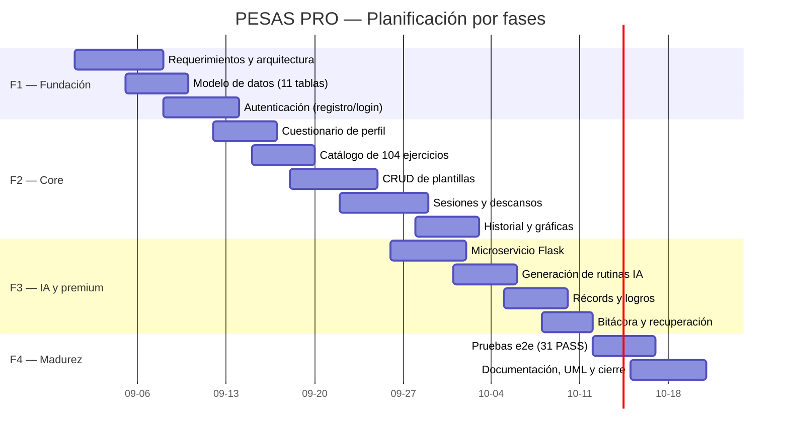

# Planificación del Proyecto — PESAS PRO

Documento de planificación del desarrollo del sistema, siguiendo el Entregable II: planificación, actividades e hitos, asignación de responsabilidades, diagrama de Gantt y análisis/gestión de riesgos.

---

## 1. Planificación general

Metodología de trabajo: **Scrum adaptado a desarrollo individual**, con sprints semanales y entregables incrementales verificables contra la API real (pruebas e2e).

| Fase | Nombre | Actividades | Hitos |
|---|---|---|---|
| **F1** | Fundación sólida | Levantamiento de requerimientos; definición de arquitectura en capas; modelo de datos (11 tablas); base de autenticación (registro/login, tokens 24 h, bcrypt). | BD creada y poblada; API de autenticación funcional. |
| **F2** | Core diferenciador | Cuestionario de perfil; catálogo de 104 ejercicios; CRUD de plantillas; sesiones de entrenamiento con descansos; historial + gráficas. | Primera sesión completa registrable; historial visible. |
| **F3** | Experiencia premium | Microservicio de IA en `:5001` (Gemini → Ollama → heurística); recomendaciones personalizadas; récords; logros/medallas; bitácora; recuperación de contraseña. | Rutina generada por IA guardada en BD; récords y logros activos. |
| **F4** | Madurez operativa | Pruebas e2e exhaustivas (31 PASS); seguridad (`.env`, consultas preparadas, RNF9/10); documentación del repositorio (UML, guías); cierre. | Repositorio documentado y listo para revisión. |

## 2. Actividades e hitos

| Hito | Entregable | Estado |
|---|---|---|
| H1 | Modelo de datos (PostgreSQL) + seeds | ✅ Completo |
| H2 | Backend PHP — autenticación, DAOs, 8 endpoints | ✅ Completo |
| H3 | Frontend — Login, Panel, Cuestionario, Catálogo, Plantillas | ✅ Completo |
| H4 | Sesiones de entrenamiento + descansos + XP/nivel | ✅ Completo |
| H5 | Historial, gráficas (Chart.js), récords y logros | ✅ Completo |
| H6 | Microservicio de IA (`:5001`) y panel de IA en Rutinas | ✅ Completo |
| H7 | Bitácora y recuperación de contraseña | ✅ Completo |
| H8 | Pruebas e2e (31/31 PASS) y documentación del repo | ✅ Completo |

## 3. Asignación de responsabilidades

| Responsable | Roles | Áreas |
|---|---|---|
| Félix Ricardo Aranguren Martínez | Backend, Frontend, Base de datos, IA, Pruebas, Documentación | Todo el ciclo: `api/`, `dao/`, `python/`, `script.js`, `index.html`, `styles.css`, SQL, pruebas e2e, UML y guías del repositorio. |

> *Si el equipo incluye más integrantes, completar aquí la matriz de responsabilidad (quién es responsable, quién apoyó y quién revisó).*

## 4. Diagrama de Gantt (semanas 1–8)

> Las fechas corresponden al semestre (septiembre–octubre 2026). Las fases se solapan porque la integración fue incremental.

## 5. Análisis y gestión de riesgos

| # | Riesgo | Probabilidad | Impacto | Mitigación aplicada |
|---|---|---|---|---|
| R1 | La API gratuita de Gemini limita o falla | Alta | Medio | Motor en cascada: de detectar fallo, cae a Ollama o a la heurística local (siempre disponible). |
| R2 | Exposición de credenciales (BD, Gemini) | Medio | Alto | `.env` ignorado por Git; revisión de historial antes del push; verificación `git grep` de secretos. |
| R3 | Puertos 8000/5432/5001 ocupados o servicios caídos | Media | Alto | Documentación de arranque con `.bat`; respuestas de error claras y código HTTP 5xx. |
| R4 | Inyección SQL / manipulación de datos ajenos | Baja | Alto | Consultas preparadas (PDO) en los DAOs; verificación de propiedad (`verificarAcceso`, `buscarAccesible`). |
| R5 | Desviación del PDF de la asignatura (lenguaje BD y roles) | Media | Alto | `ESTUDIO_CUMPLIMIENTO.md` con brechas y plan de migración a 3 roles; requerimientos consolidados en `REQUERIMIENTOS_CONSOLIDADOS.md`. |
| R6 | Diagramas UML desalineados con el código final | Media | Medio | Diagramas regenerados desde los DAOs reales (métodos verificados) en `docs/diagramas/`. |
| R7 | Pérdida de datos / backups | Media | Medio | Scripts `.sql` versionados (esquema + seeds) permiten reconstruir la base en cualquier momento. |
| R8 | Curva de aprendizaje de librerías (Chart.js, Flask) | Media | Baja | Uso de vanilla JS para el núcleo; CDNs; documentación de cada integración. |

---
*Documento vivo — se actualiza al cierre de cada fase.*